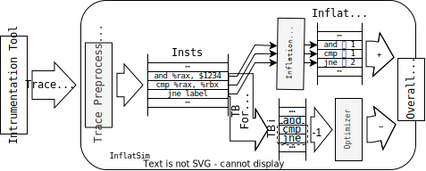

This is the repo for the journal essay: [An Instruction Inflation Analyzing Framework for Dynamic Binary Translators](https://doi.org/10.1145/3640813).

## InflatSim🎈🖥️


InflatSim is a trace-based inflation simulator designed to decompose translation inflation in Dynamic Binary Translation (DBT).
It is agnostic to both Instruction Set Architecture (ISA) and Dynamic Binary Translation (DBT) technology, making it a versatile tool.

🔍 InflatSim processes trace information, much like a DBT.
However, instead of emulating the functionality of each instruction, InflatSim consumes trace information from an instrumentation tool.

🛠️ The instrumentation tool can be either hardware-based, such as Intel's Processor Trace and ARM's CoreSight Trace, or software-based, such as Pin, DynamoRIO, and QEMU TCG plugin.
In this project, we use the QEMU TCG plugin to instrument programs.

🧩 The trace information, including PC traces and instruction binary codes, is processed by InflatSim's three components:
disassembler, inflation calculator, and optimizer, as depicted in the following picture:



🌟 Now, we support three commercial DBT: Huawei's Exagear, Apple's Rosetta2, and Loongson's LATX:

1. Huawei’s ExaGear is designed to run x86-64 applications on Kunpeng (ARM64) Linux server. 
2. Apple’s Rosetta has two versions: an Ahead-Of-Time (AOT) DBT for running X86-64 macOS applications on M-series silicon (ARM64) macOS,
  and a Just-In-Time (JIT) DBT for running X86-64 Linux applications on ARM64 Linux virtual machine. We simulate the JIT version.
3. Loongson’s LATX  is designed for newly introduced RISC ISA called LoongArch.
  LATX can run X86-64Linux applications on LoongArch Linux server and personal computer.

## Build Instructions💻:

We recommend installing Nix. You can download it from https://nixos.org/download.html.

### Build by Nix

```bash
nix-build
```

### Compile by yourself

```bash
# Enter the Nix environment
# it may take some time to download all the necessary dependencies for the first time
nix-shell
make
```

## Usage📚:

```bash
# analysis the simulation of ls
./inflatsim -- ls
# get more help
./inflatsim -h
```
